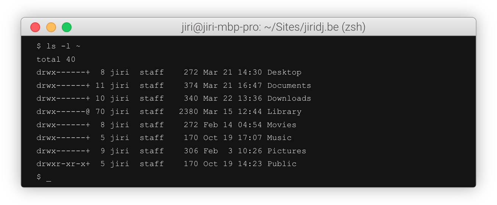
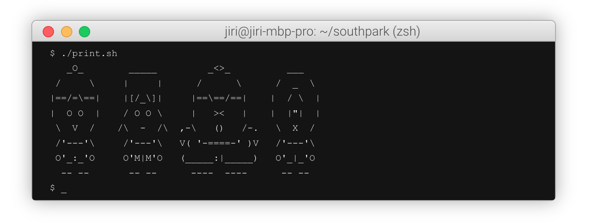

# Hugo MacOS Terminal

A Hugo shortcode for beautiful MacOS-like terminals in your web pages. 

## Why did I build this?

When you blog about technology, you have to explain a lot of stuff you do on the command line. I never really found a good way of illustrating what you do on the command line in a blog post. You’ll agree that screenshots are not a good solution. Your readers can’t copy-paste the commands and they make pages slower to load. [Highlight.js](https://highlightjs.org/) is a good solution for syntax highlighting, but it does not support command line syntax well.

Until I find someting better, I have created my own solution with HTML and CSS. I got the inspiration from a blog post on [creating a Mac Terminal lookalike in CSS](http://www.codechewing.com/library/mac-terminal-shell-css-html). I refined the MacOS titlebar looks with tips I got from a pen on [creating an OSX window with CSS](https://codepen.io/JohJakob/pen/YPxgwo). **Kudos to Peter and Jakob!** 

It looks pretty neat, it is really easy to manage and it loads in the blink of a eye.

## How does it work?

The code behind the example above is really simple. It’s just a few CSS-styled `<div>`’s, `<a>`’s and `<li>`’s. Each line in the terminal is actually an entry in an unordered list.

You can obviously embed this in any web page, but since I use the Hugo static site generator, I’ve created a shortcode to make it really easy. If you look at the shortcode, you'll notice I replace all spaces by non-breaking spaces. In command-line output whitespace is important, so I want to make sure it is preserved when you minify your html.

## Example usage

The shortcode has been written in such a way that you can simply copy and paste the output of your terminal between the shortcode start and end tag.

```

$ ls -l ~
total 40
drwx------+  8 jiri  staff    272 Mar 21 14:30 Desktop
drwx------+ 11 jiri  staff    374 Mar 21 16:47 Documents
drwx------+ 10 jiri  staff    340 Mar 22 13:36 Downloads
drwx------@ 70 jiri  staff   2380 Mar 15 12:44 Library
drwx------+  8 jiri  staff    272 Feb 14 04:54 Movies
drwx------+  5 jiri  staff    170 Oct 19 17:07 Music
drwx------+  9 jiri  staff    306 Feb  3 10:26 Pictures
drwxr-xr-x+  5 jiri  staff    170 Oct 19 14:23 Public
$ _

```
And it comes out looking like this!



Have fun! 😄


